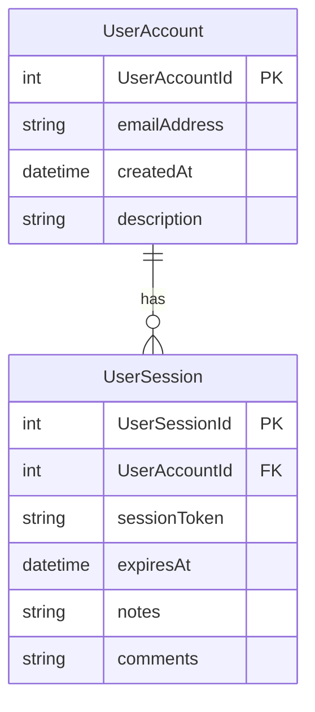

# Instruction (must follow): Coding Guideline Execution — Database & Data Schema Rules

Trigger Keywords & Aliases: `cg-schema`, `cg-execute schema`, `audit schema`, `fix schema guidelines`, `enforce database standards`

```text
N = 100
```

N = total self-loop steps budget for scanning, spec planning, and autonomously resolving all database and schema guideline violations.

- [ ] /goal First `N/2` steps (Phase 1) are dedicated to scanning the codebase for schema, database model, and query violations, writing the master audit spec into `.lovable/plans/pending/XX-data-and-schema-audit.md`, generating missing Mermaid ERD diagrams, decomposing into subtasks in `.lovable/plans/subtasks/XX-data-and-schema/`, and verifying/creating the dedicated schema linter in `linter-scripts/`.
- [ ] /goal Second `N/2` steps (Phase 2) are dedicated to executing each subtask sequentially, refactoring tables, entities, columns, and relations to adhere to PascalCase/camelCase standards, integer `{TableName}Id` primary keys, and explicit foreign keys, running the schema linter, and verifying all local CI gates exit with code 0.
- [ ] /learn Ingest `.lovable/coding-guidelines/coding-guidelines.md`, `.lovable/strictly-avoid.md`, and `.lovable/memory/issues/` before modifying code.

```text
PHASE_1_STEPS = N / 2   (Steps 1 .. N/2)
PHASE_2_STEPS = N / 2   (Steps N/2+1 .. N)
```

N, PHASE_1_STEPS, and PHASE_2_STEPS are read-only after initialization.

---

## Phase 0: Antigravity Skill Bootstrap (Memory Optimization)

Before execution, check if `.agents/skills/coding-guidelines/skill.md` exists. If missing, create it with YAML frontmatter (`name: coding-guidelines`, `description: "Audits and enforces cross-language database and schema coding standards."`).

---

## Phase 1: Scan, Spec, Subtasks & Linter Verification (Steps 1 to PHASE_1_STEPS)

> [!IMPORTANT]
> **Phase 1 is dedicated to discovery, planning, and tooling setup. Do NOT alter database migrations or models in Phase 1.**

### Step 1: Ingest Authoritative Data & Schema Rules

1. **Naming Conventions:**
   - Tables, Entities, Models: **PascalCase** (e.g. `UserAccount`, `OrderTransaction`, `ProductItem`).
   - Fields, Columns, Attributes: **camelCase** (e.g. `userId`, `createdAt`, `totalAmount`).
   - JSON Payload Keys: **PascalCase** (e.g. `{ "UserId": 100, "CreatedAt": "..." }`).
2. **Primary Key Standard:**
   - Every primary key MUST be an integer auto-increment named `{TableName}Id` (e.g. `UserAccountId`, `OrderTransactionId`).
   - Raw UUIDs as primary keys are forbidden unless explicitly mandated by external distributed sync contracts.
3. **Structured Join Tables for Categories/Status:**
   - `Type`, `Status`, `Category`, and `Kind` columns must use a 1-N or N-M relation with a registered enum or join table. Never use free-form unconstrained string columns.
4. **Standard Metadata Columns:**
   - Entity & Reference tables MUST include `Description TEXT NULL`.
   - Transactional tables MUST include `Notes TEXT NULL` and `Comments TEXT NULL`.
   - All optional metadata fields are nullable with no raw default placeholders.
5. **SQLite & Explicit ORM Relations:**
   - Explicitly declare all foreign key constraints, indexes, and join mappings.
6. **Mandatory Mermaid ERD:**
   - Any schema modification or audit MUST generate or update a comprehensive Mermaid ERD diagram representing all table relationships.

### Step 2: Codebase-Wide Schema Scan

Search all SQL files, migration scripts, ORM entities, and schema definitions for:

- Snake_case or kebab-case table names (e.g. `user_accounts` vs `UserAccount`).
- Non-standard primary keys (e.g. bare `id`, `uuid`, `user_id` vs `UserAccountId`).
- Snake_case column names (e.g. `created_at` vs `createdAt`).
- Missing foreign key constraints or un-indexed join keys.
- Free-form string status/type fields lacking enum validation.
- Missing Mermaid ERDs in schema documentation.

### Step 3: Write Master Audit Spec & Mermaid ERD

Save the complete schema audit to `.lovable/plans/pending/XX-data-and-schema-audit.md`:

- Embed the full Mermaid ERD diagram illustrating the compliant schema architecture.
- Document exact migration scripts, entity files, and columns requiring refactoring.
- Register the spec in `.lovable/plans/index.md`.

### Step 4: Decompose into Subtasks

Break down into subtasks under `.lovable/plans/subtasks/XX-data-and-schema/`:

- `01-primary-and-foreign-keys.md` (Standardizing `{TableName}Id` and foreign key constraints)
- `02-column-naming.md` (Converting column names to camelCase and JSON keys to PascalCase)
- `03-metadata-and-status-tables.md` (Enforcing join tables and standard metadata fields)

### Step 5: Linter Verification & CI/CD Connection (Mandatory Checklist)

- [ ] **Check Linter Script Existence:** Check if `linter-scripts/check-schema-guidelines.py` exists.
- [ ] **Create Linter Script if Missing:** If missing, create `linter-scripts/check-schema-guidelines.py` that parses SQL schema/migrations and ORM models, validating table PascalCase, column camelCase, `{TableName}Id` keys, and explicit foreign key constraints.
- [ ] **Local Linter Command:** Verify the linter runs locally with:
  ```bash
  python linter-scripts/check-schema-guidelines.py
  ```
- [ ] **CI/CD Integration:** Connect the linter into `.lovable/ai-fix-scripts/03-cicd-local-runner.py` under `JOBS`:
  ```python
  JOBS["lint:schema"] = ["python", "linter-scripts/check-schema-guidelines.py"]
  ```
  And verify it is present in `.github/workflows/ci.yml`.

---

## Phase 2: Autonomous Subtask Execution Loop (Steps PHASE_1_STEPS+1 to N)

> [!IMPORTANT]
> **AUTONOMOUS EXECUTION MANDATE — DO NOT STOP.**
> Sequentially execute each subtask, applying surgical schema refactors and migration updates until all checks pass 100% green.

```text
STEP = 0
WHILE (STEP < PHASE_2_STEPS):
    STEP += 1

    1. Read the next subtask from .lovable/plans/subtasks/XX-data-and-schema/
    2. Apply surgical refactoring to schema migrations, ORM entities, and repository queries.
    3. Run the schema linter:
          python linter-scripts/check-schema-guidelines.py
    4. Run database unit and integration test suites.
    5. Run the local CI runner:
          python .lovable/ai-fix-scripts/03-cicd-local-runner.py
    6. IF any check fails:
          - Diagnose failure, fix entity/migration mismatch, and re-test immediately.
       IF all checks pass (exit code 0):
          - Mark subtask completed and proceed to next subtask.

    7. When all subtasks are finished and local CI is 100% green:
          - BREAK and proceed to End of Tunnel.
```

---

## Authoritative Schema Reference (SQL & Mermaid ERD)

```sql
-- GOOD: PascalCase table, camelCase columns, {TableName}Id integer PK, explicit FKs
CREATE TABLE UserAccount (
    UserAccountId INTEGER PRIMARY KEY AUTOINCREMENT,
    emailAddress  TEXT NOT NULL UNIQUE,
    createdAt     DATETIME NOT NULL DEFAULT CURRENT_TIMESTAMP,
    description   TEXT NULL
);

CREATE TABLE UserSession (
    UserSessionId INTEGER PRIMARY KEY AUTOINCREMENT,
    UserAccountId INTEGER NOT NULL,
    sessionToken  TEXT NOT NULL UNIQUE,
    expiresAt     DATETIME NOT NULL,
    notes         TEXT NULL,
    comments      TEXT NULL,
    FOREIGN KEY (UserAccountId) REFERENCES UserAccount(UserAccountId) ON DELETE CASCADE
);
```



---

## Pre-Reply / Loop Checklist

- [ ] All table names are PascalCase.
- [ ] All column names are camelCase.
- [ ] Primary keys are `{TableName}Id` integers.
- [ ] Foreign keys explicitly defined with index support.
- [ ] Mermaid ERD diagram updated in schema docs.
- [ ] `python linter-scripts/check-schema-guidelines.py` exited with code 0.
- [ ] Local CI runner `python .lovable/ai-fix-scripts/03-cicd-local-runner.py` exited with code 0.

---

## No Automatic Releases (Strict Policy)

> [!CAUTION]
> This is a development refactoring workflow. You MUST NOT bump versions, update changelogs, or cut a release at the end of this task. Commits must remain standard development commits (e.g. `refactor(schema): standardize entity models and keys`).

---

## End of Tunnel Checklist

- [ ] Schema linter and database migration tests exit with code 0.
- [ ] `03-cicd-local-runner.py` passes 100% green.
- [ ] Master plan moved to `.lovable/plans/completed/XX-data-and-schema-audit.md`.
- [ ] Clean commit pushed to current branch.
- [ ] File Change Summary posted in chat with updated ERD diagram reference.

---

## Metadata

- slug: cg-data-and-schema
- priority: medium
- status: active
